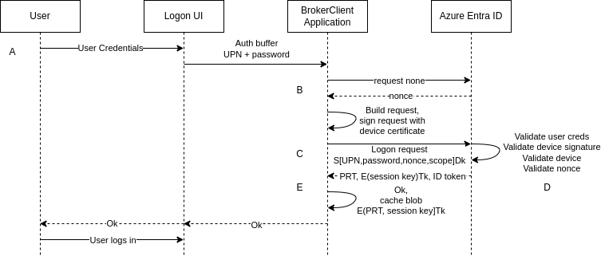

# MSAL for Rust - Software Design Document

## Table of Contents
1. [Introduction](#introduction)
2. [Purpose](#purpose)
3. [Scope](#scope)
4. [Architecture Overview](#architecture-overview)
5. [Usage](#usage)
6. [Dependencies](#dependencies)
7. [API Reference](#api-reference)
8. [Contributing](#contributing)
9. [License](#license)

## Introduction 
This document provides an overview of the design and architecture of MSAL for
Rust, a Rust implementation of the Microsoft Authentication Library (MSAL).

## Purpose 
The purpose of this community-driven project is to provide Rust developers with
a robust implementation of Microsoft Authentication Library (MSAL) protocols,
enabling them to authenticate users and acquire tokens to access Microsoft APIs
securely. While the project implements various Microsoft protocols and
specifications, it's essential to note that it is not affiliated with nor
endorsed by Microsoft. Instead, it is maintained and developed by the community.

## Scope 
The scope of this project includes:

- Implementation of MSAL's PublicClientApplication Class
- Integration with the MS-DRS protocol
- Implementation of MS-OAPXBC sections for primary refresh token requests and
  exchanges

## Architecture Overview 

The architecture of the MSAL for Rust project is designed to provide
comprehensive support for Microsoft Authentication Library (MSAL)
functionalities in Rust programming language. This section provides an overview
of the key components, their interactions, and the overall design principles
guiding the project.

### Key Components

#### 1. PublicClientApplication

The `PublicClientApplication` component serves as a fundamental building block
for enabling authentication in public client applications. It is designed to
streamline the authentication process by providing a comprehensive set of
functionalities for acquiring tokens via various authentication methods.

##### Key Features

- Token Acquisition: The primary purpose of the `PublicClientApplication` is to
facilitate the acquisition of access tokens required for accessing protected
resources. It offers support for multiple authentication methods, including
username/password authentication, device flow, and various Multi-Factor
Authentication (MFA) flows.

- Compatibility with MSAL Documentation: This component somewhat aligns with
[Microsoft's official Python implementation](https://learn.microsoft.com/en-us/python/api/msal/msal.application.publicclientapplication?view=msal-py-latest)
of a `PublicClientApplication`. Developers can leverage the Rust implementation
of `PublicClientApplication` as a replacement for its Python counterpart, as
specified in Microsoft's MSAL documentation. This ensures easy integration with
existing codebases and familiarity for developers transitioning between
different programming languages.

- Ease of Use: The component is designed to be developer-friendly, with
intuitive APIs and clear documentation to guide developers through the
authentication process. It abstracts away the complexity of authentication
protocols, allowing developers to focus on building secure and reliable
applications.

##### Intended Use

The `PublicClientApplication` is well-suited for scenarios where the client
application operates in a public or user-facing context, such as desktop
applications, mobile apps, or single-page web applications. It provides the
necessary tools and capabilities to authenticate users securely and efficiently,
while adhering to Microsoft's best practices and standards.

#### 2. BrokerClientApplication

The `BrokerClientApplication` component extends the functionality of the
`PublicClientApplication` by offering advanced features like device enrollment,
Primary Refresh Token (PRT) requests, Token Generation Ticket (TGT) requests,
and Windows Hello for Business key provisioning and authentication.

##### MS-DRS Protocol Implementation

One of the critical components of the BrokerClientApplication is facilitating
device enrollment within an Azure Entra ID tenant. Despite the absence of
official documentation from Microsoft regarding device enrollment in Entra ID,
this project undertook the task of exploring and documenting this process. This
effort is documented in detail within the
[MS-DRS repository](https://github.com/himmelblau-idm/aad-join-spec), shedding
light on the intricacies of device enrollment within the Entra ID ecosystem.

##### MS-OAPX/OAPXBC Extensions

Microsoft's OAuth 2.0 Protocol Extensions ([MS-OAPXBC]) offer additional
authentication capabilities and protocols provided by Microsoft. Particularly
noteworthy are the **Request for Primary Refresh Token** and **Exchange Primary
Refresh Token for Access Token** functionalities.

A Primary Refresh Token (PRT) is a JSON Web Token (JWT) specifically issued to
Microsoft's first-party token brokers to facilitate single sign-on (SSO) across
applications used on those devices.

The PRT encompasses claims commonly found in Microsoft Entra ID refresh tokens,
along with certain device-specific claims, including:

- **Device ID**: Identifies the device to which the PRT was issued for the user.
This claim plays a crucial role in determining device-specific authorization for
Conditional Access based on device state or compliance.
  
- **Session Key**: An encrypted symmetric key generated by the Microsoft Entra
authentication service and included as part of the PRT. The session key serves
as proof of possession when utilizing the PRT to acquire tokens for other
applications.

Additionally, the project utilizes an undocumented `tgt` parameter during PRT
requests. This parameter allows for the retrieval of both a cloud TGT and, if
configured, an on-prem TGT. This enhances the flexibility and broadens the scope
of available authentication mechanisms.

### Design Principles

#### 1. Adherence to Microsoft Specifications and Windows Behavior

While the project aims to align with Microsoft specifications where feasible,
our primary guiding principle is adherence to actual Windows behavior. This
approach ensures compatibility and interoperability within Microsoft's
authentication ecosystem while accommodating any deviations or inaccuracies
found in the specifications.

#### 2. Collaboration

This project is developed with a collaborative mindset. We prioritize
transparency and consensus-building among contributors to ensure the
project's success. Emphasizing modularity, robustness, and interoperability, our
design principles focus on creating scalable, reliable, and adaptable solutions
that meet the evolving needs of our users. By fostering a culture of continuous
improvement and knowledge sharing, we strive to build a vibrant and supportive
ecosystem around our project.

This project is developed by the open-source community. We prioritize
community-driven development, welcoming contributions and feedback from
developers worldwide.

### Interaction Diagrams

Since we try to adhere to Windows behavior, it's helpful to review Microsoft
design flows which explain those behaviors, such as
[How it works: Device registration](https://learn.microsoft.com/en-us/entra/identity/devices/device-registration-how-it-works#microsoft-entra-joined-in-managed-environments)
and
[Primary Refresh Token Issuance](https://learn.microsoft.com/en-us/entra/identity/devices/concept-primary-refresh-token#prt-issuance-during-first-sign-in).
These flows are similar to the behavior of this project, but project specific
design flows are provided here for clarity.

#### Device Enrollment

  

**A:** Enrollment is first initiated by authenticating to the
https://enrollment.manage.microsoft.com resource. This is accomplished using the
functions `acquire_token_by_username_password_for_device_enrollment()`,
`initiate_device_flow_for_device_enrollment()` paired with
`acquire_token_by_device_flow()`, or
`initiate_acquire_token_by_mfa_flow_for_device_enrollment()` paired with
`acquire_token_by_mfa_flow()`. The `UserToken` from the response is then
provided in a call to `enroll_device()`.

**B:** The `enroll_device()` function communicates with the TPM and creates 2
RSA keys. One will be used as the transport key, and the other will be used
to create a Certificate Signing Request (CSR). The source for this request is
found in `src/auth.rs` within the `BrokerClientApplication` struct
implementation.

**C:** `enroll_device()` sends a GET request to
https://enterpriseregistration.windows.net requesting a list of available
services. This request is defined in
[[MS-DRS] Section 3.1](https://github.com/himmelblau-idm/aad-join-spec/blob/main/aad-join-spec.md#31-device-registration-discovery-service)
and [[MS-DVRD] Section 4.3](https://learn.microsoft.com/en-us/openspecs/windows_protocols/ms-dvrd/8d2cc934-a5ac-4356-84fb-e7673b078a4c).
The source for this request is found in `src/discovery.rs`.

**D:** The `enroll_device_internal()` function processes the public transport
key by generating a 
[BCRYPT_RSAKEY_BLOB](https://learn.microsoft.com/en-us/windows/win32/api/bcrypt/ns-bcrypt-bcrypt_rsakey_blob),
which is then encoded in base64 format.

**E:** The encoded transport key blob is subsequently included in the enrollment
request payload, along with the Certificate Signing Request (CSR), which is also
base64 encoded. These, included with the enrollment attributes passed to
`enroll_device()`, are sent to the Azure DRS service for enrollment. The DRS
service validates the access token received in **A**, creates a device id, then
generates and signs a device certificate as requested. The device certificate
is returned to the client.

**F:** The device certificate is associated with the transport key in the TPM.

MDM enrollment is not yet implemented.

#### PRT Issuance via Username/Password

  

**A:** The logon UI passes the UPN and password to
`acquire_user_prt_by_username_password()`.

**B:** `build_jwt_by_username_password()` gets a nonce from Microsoft Entra ID.

**C:** `build_jwt_by_username_password()` constructs the authentication request
with the user’s credentials, nonce, and a scope, and signs the request with the
Device key. `acquire_user_prt_jwt()` sends the request to Microsoft Entra ID.

**D:** Microsoft Entra ID validates the user credentials, the nonce, and device
signature, verifies that the device is valid in the tenant and issues the
encrypted PRT. Along with the PRT, Microsoft Entra ID also issues a symmetric
key, called the Session key encrypted by Microsoft Entra ID using the Transport
key. In addition, the Session key is also embedded in the PRT. This Session key
acts as the Proof-of-possession (PoP) key for subsequent requests with the PRT.
Up to two Kerberos TGTs are embeded in the PRT, labeled `tgt_ad` and
`tgt_cloud`. The first is an on-prem TGT (if configured), while the second is an
Azure cloud TGT.

**E:** `acquire_user_prt_by_username_password()` encrypts the PRT using the
Transport key and returns the encrypted blob. `exchange_prt_for_access_token()`
can then be called to obtain an access token for the user.

## Usage 
To use this library:

1. Import the module into your project:
`cargo add msal`
2. Create an instance of either PublicClientApplication or
BrokerClientApplication, depending on your authentication requirements.
3. Authenticate users using various methods provided by the chosen application
class. Methods beginning with `acquire_user_prt_` take various authentication
inputs and produce a Primary Refresh Token (PRT).
`exchange_prt_for_access_token` exchanges that PRT for a UserToken object. This
object usually has both an oauth2 access token and a refresh token. Methods
beginning with `acquire_token_` simplify the process by sending both a PRT
acquire and a PRT exchange.

For more detailed usage examples, refer to the README.md file in the repository.

## Dependencies 

### Rust dependencies

There are many external rust dependencies, but the significant ones are:

- [Kanidm HSM Crypto](https://github.com/kanidm/kanidm): Dependency for TPM
  functionality.
- [Kanidm Compact Jwt](https://github.com/kanidm/compact-jwt): Dependency for 
  Jwt processing.

### Microsoft dependencies

The MSAL for Rust project relies on the following Microsoft specifications and
protocols:

- [MS-OAPX]: OAuth 2.0 Protocol Extensions
  - Description: Used in both PublicClientApplication and
    BrokerClientApplication for authentication.

- [MS-OAPXBC]: OAuth 2.0 Protocol Extensions for Broker Clients
  - Description: Specifically utilized in the BrokerClientApplication for
    advanced authentication features.

- [MS-DVRJ]: Device Registration Join Protocol
  - Description: Sections 3.1.5.1.1.1 and 3.1.5.1.1.2 are mostly accurate and
    used in [[MS-DRS] Section 2.1](https://github.com/himmelblau-idm/aad-join-spec/blob/main/aad-join-spec.md#21-join-service-details).

- [MS-DVRD]: Device Registration Discovery Protocol
  - Description: Accurate, but missing many services. See [[MS-DRS] Section 3.1](https://github.com/himmelblau-idm/aad-join-spec/blob/main/aad-join-spec.md#31-device-registration-discovery-service).

- [MS-KKDCP]: Kerberos Key Distribution Center (KDC) Proxy Protocol
  - Description: Used by MSAL to retrieve cloud and on-prem Kerberos TGTs
    (currently work in progress).

- [MS-KPP]: Key Provisioning Protocol
  - Description: Utilized by MSAL to provision a Windows Hello for Business key.
    The process for requesting a PRT using that key does not appear to be
    documented, although MSAL copies Windows behavior here to request the PRT.

## API Reference 

### 1. PublicClientApplication

Provides functionalities for basic authentication using the PublicClientApplication Class.

#### Implementation Details

##### `new(client_id: &str, authority: Option<&str>) -> Result<Self, MsalError>`
Create an instance of an application.

###### Arguments
- `client_id`: Your app has a client_id after you register it on AAD.
- `authority`: A URL that identifies a token authority. It should be of the format https://login.microsoftonline.com/your_tenant By default, we will use https://login.microsoftonline.com/common.

###### Returns
- `Ok(Self)`: An instance of PublicClientApplication.
- `Err(MsalError)`: An MsalError, indicating failure.

##### `acquire_token_by_username_password(username: &str, password: &str, scopes: Vec<&str>) -> Result<UserToken, MsalError>`
Gets a token for a given resource via user credentials.

###### Arguments
- `username`: Typically a UPN in the form of an email address.
- `password`: The password.
- `scopes`: Scopes requested to access a protected API (a resource).

###### Returns
- `Ok(UserToken)`: A UserToken containing an access_token.
- `Err(MsalError)`: An MsalError, indicating failure.

##### `acquire_token_by_refresh_token(refresh_token: &str, scopes: Vec<&str>) -> Result<UserToken, MsalError>`
Acquire token(s) based on a refresh token (RT) obtained from elsewhere.

###### Arguments
- `refresh_token`: The old refresh token, as a string.
- `scopes`: The scopes associated with this old RT.

###### Returns
- `Ok(UserToken)`: A UserToken, which means migration was successful.
- `Err(MsalError)`: An MsalError, indicating failure.

##### `initiate_device_flow(scopes: Vec<&str>) -> Result<DeviceAuthorizationResponse, MsalError>`
Initiate a Device Flow instance, which will be used in acquire_token_by_device_flow.

###### Arguments
- `scopes`: Scopes requested to access a protected API (a resource).

###### Returns
- `Ok(DeviceAuthorizationResponse)`: A DeviceAuthorizationResponse containing a user_code key, among others.
- `Err(MsalError)`: An MsalError, indicating failure.

##### `acquire_token_by_device_flow(flow: DeviceAuthorizationResponse) -> Result<UserToken, MsalError>`
Obtain token by a device flow object, with customizable polling effect.

###### Arguments
- `flow`: A DeviceAuthorizationResponse previously generated by initiate_device_flow.

###### Returns
- `Ok(UserToken)`: A UserToken containing an access_token.
- `Err(MsalError)`: An MsalError, indicating failure.

##### `initiate_acquire_token_by_mfa_flow(username: &str, password: &str, scopes: Vec<&str>, resource: Option<&str>) -> Result<MFAAuthContinue, MsalError>`
Initiate an MFA flow via user credentials.

###### Arguments
- `username`: Typically a UPN in the form of an email address.
- `password`: The password.
- `scopes`: Scopes requested to access a protected API (a resource).
- `request_resource`: A resource for obtaining an access token. Default is the MS Graph API (00000002-0000-0000-c000-000000000000).

###### Returns
- `Ok(MFAAuthContinue)`: A MFAAuthContinue containing the information needed to continue the authentication flow.
- `Err(MsalError)`: An MsalError, indicating failure.

##### `acquire_token_by_mfa_flow(username: &str, auth_data: Option<&str>, flow: MFAAuthContinue) -> Result<UserToken, MsalError>`
Obtain token by a MFA flow object.

###### Arguments
- `username`: Typically a UPN in the form of an email address.
- `auth_data`: An optional token received for the MFA flow (some MFA flows do not require input).
- `flow`: A MFAAuthContinue previously generated by initiate_acquire_token_by_mfa_flow.

###### Returns
- `Ok(UserToken)`: A UserToken containing an access_token.
- `Err(MsalError)`: An MsalError, indicating failure.

### 2. BrokerClientApplication
Extends the functionality of authentication provided by PublicClientApplication to include advanced features such as device enrollment, PRT (Primary Refresh Token) requests, TGT requests, and Windows Hello for Business key provisioning.

#### Implementation Details

##### `new(authority: Option<&str>, transport_key: Option<LoadableMsOapxbcRsaKey>, cert_key: Option<LoadableIdentityKey>) -> Result<Self, MsalError>`
Creates an instance of the application.

###### Arguments
- `authority`: A URL that identifies a token authority. Default is `https://login.microsoftonline.com/common`.
- `transport_key`: An optional transport key obtained from device enrollment.
- `cert_key`: An optional certificate key used for enrollment CSR creation.

###### Returns
- `Ok(Self)`: Successfully created instance of BrokerClientApplication.
- `Err(MsalError)`: Failed to create instance due to an error.

##### `enroll_device(token: &UserToken, attrs: EnrollAttrs, tpm: &mut BoxedDynTpm, machine_key: &MachineKey) -> Result<(LoadableMsOapxbcRsaKey, LoadableIdentityKey, String), MsalError>`
Enrolls the device in the directory.

###### Arguments
- `token`: Token obtained via device enrollment methods.
- `attrs`: Attributes for device enrollment.
- `tpm`: TPM object.
- `machine_key`: TPM MachineKey associated with this application.

###### Returns
- `(transport_key, cert_key, device_id)`: Transport key, certificate key, and device ID on success.
- `Err(MsalError)`: Error indicating the failure.

##### `acquire_token_by_username_password(username: &str, password: &str, scopes: Vec<&str>, tpm: &mut BoxedDynTpm, machine_key: &MachineKey) -> Result<UserToken, MsalError>`
Obtains a token for a given resource via user credentials.

###### Arguments
- `username`: User's UPN (email address).
- `password`: User's password.
- `scopes`: Scopes requested to access a protected API.
- `tpm`: TPM object.
- `machine_key`: TPM MachineKey associated with this application.

###### Returns
- `Ok(UserToken)`: Token containing an access token.
- `Err(MsalError)`: Error indicating the failure.

##### `acquire_token_by_refresh_token(refresh_token: &str, scopes: Vec<&str>, tpm: &mut BoxedDynTpm, machine_key: &MachineKey) -> Result<UserToken, MsalError>`
Acquires token(s) based on a refresh token (RT) obtained from elsewhere.

###### Arguments
- `refresh_token`: The old refresh token, as a string.
- `scopes`: The scopes associated with this old RT.
- `tpm`: The TPM object.
- `machine_key`: The TPM MachineKey associated with this application.

###### Returns
- `Ok(UserToken)`: A UserToken, indicating successful migration.
- `Err(MsalError)`: An MsalError, indicating failure.

##### `acquire_token_by_username_password_for_device_enrollment(username: &str, password: &str) -> Result<UserToken, MsalError>`
Gets a token for enrollment via user credentials.

###### Arguments
- `username`: Typically a UPN in the form of an email address.
- `password`: The password.

###### Returns
- `Ok(UserToken)`: A UserToken containing an access_token.
- `Err(MsalError)`: An MsalError, indicating failure.

##### `initiate_device_flow_for_device_enrollment() -> Result<DeviceAuthorizationResponse, MsalError>`
Initiates a Device Flow instance for enrollment, used in acquire_token_by_device_flow.

###### Returns
- `Ok(DeviceAuthorizationResponse)`: A DeviceAuthorizationResponse containing a user_code key, among others.
- `Err(MsalError)`: An MsalError, indicating failure.

##### `acquire_token_by_device_flow(flow: DeviceAuthorizationResponse) -> Result<UserToken, MsalError>`
Obtains token for enrollment by a device flow object, with customizable polling effect.

###### Arguments
- `flow`: A DeviceAuthorizationResponse previously generated by initiate_device_flow.

###### Returns
- `Ok(UserToken)`: A UserToken containing an access_token.
- `Err(MsalError)`: An MsalError, indicating failure.

##### `initiate_acquire_token_by_mfa_flow_for_device_enrollment(username: &str, password: &str) -> Result<MFAAuthContinue, MsalError>`
Initiates an MFA flow for enrollment via user credentials.

###### Arguments
- `username`: Typically a UPN in the form of an email address.
- `password`: The password.

###### Returns
- `Ok(MFAAuthContinue)`: A MFAAuthContinue containing the information needed to continue the authentication flow.
- `Err(MsalError)`: An MsalError, indicating failure.

##### `acquire_token_by_mfa_flow(username: &str, auth_data: Option<&str>, flow: MFAAuthContinue) -> Result<UserToken, MsalError>`
Obtains a token by a MFA flow object.

###### Arguments
- `username`: Typically a UPN in the form of an email address.
- `auth_data`: An optional token received for the MFA flow (some MFA flows do not require input).
- `flow`: A MFAAuthContinue previously generated by initiate_acquire_token_by_mfa_flow.

###### Returns
- `Ok(UserToken)`: A UserToken containing an access_token.
- `Err(MsalError)`: An MsalError, indicating failure.

##### `acquire_user_prt_by_username_password(username: &str, password: &str, tpm: &mut BoxedDynTpm, machine_key: &MachineKey) -> Result<SealedData, MsalError>`
Gets a Primary Refresh Token (PRT) via user credentials.

###### Arguments
- `username`: Typically a UPN in the form of an email address.
- `password`: The password.
- `tpm`: The TPM object.
- `machine_key`: The TPM MachineKey associated with this application.

###### Returns
- `Ok(SealedData)`: An encrypted PrimaryRefreshToken, containing a refresh_token and tgt.
- `Err(MsalError)`: An MsalError, indicating failure.

##### `acquire_user_prt_by_refresh_token(refresh_token: &str, tpm: &mut BoxedDynTpm, machine_key: &MachineKey) -> Result<SealedData, MsalError>`
Gets a Primary Refresh Token (PRT) via a refresh token (RT) obtained previously.

###### Arguments
- `refresh_token`: The old refresh token, as a string.
- `tpm`: The TPM object.
- `machine_key`: The TPM MachineKey associated with this application.

###### Returns
- `Ok(SealedData)`: An encrypted PrimaryRefreshToken, containing a refresh_token and tgt.
- `Err(MsalError)`: An MsalError, indicating failure.

##### `exchange_prt_for_access_token(sealed_prt: &SealedData, scope: Vec<&str>, tpm: &mut BoxedDynTpm, machine_key: &MachineKey, request_resource: Option<String>) -> Result<UserToken, MsalError>`
Given the primary refresh token, this method requests an access token.

###### Arguments
- `sealed_prt`: An encrypted primary refresh token that was previously received from the server.
- `scope`: The scope that the client requests for the access token.
- `tpm`: The TPM object.
- `machine_key`: The TPM MachineKey associated with this application.
- `request_resource`: A resource for obtaining an access token. Default is the MS Graph API (00000002-0000-0000-c000-000000000000).

###### Returns
- `Ok(UserToken)`: A UserToken containing an access_token.
- `Err(MsalError)`: An MsalError, indicating failure.

##### `exchange_prt_for_prt(sealed_prt: &SealedData, tpm: &mut BoxedDynTpm, machine_key: &MachineKey, request_tgt: bool) -> Result<SealedData, MsalError>`
Given the primary refresh token, this method requests a new primary refresh token.

###### Arguments
- `sealed_prt`: An encrypted primary refresh token that was previously received from the server.
- `tpm`: The TPM object.
- `machine_key`: The TPM MachineKey associated with this application.
- `request_tgt`: Whether to include a request for a TGT.

###### Returns
- `Ok(SealedData)`: An encrypted PrimaryRefreshToken, containing a refresh_token and optionally a tgt. The session key is copied from the old PRT.
- `Err(MsalError)`: An MsalError, indicating failure.

## Contributing 
Contributions to this project are welcome. Please refer to the CONTRIBUTING.md file for guidelines on how to contribute.

## License 
This project is licensed under the [MIT License](LICENSE).
